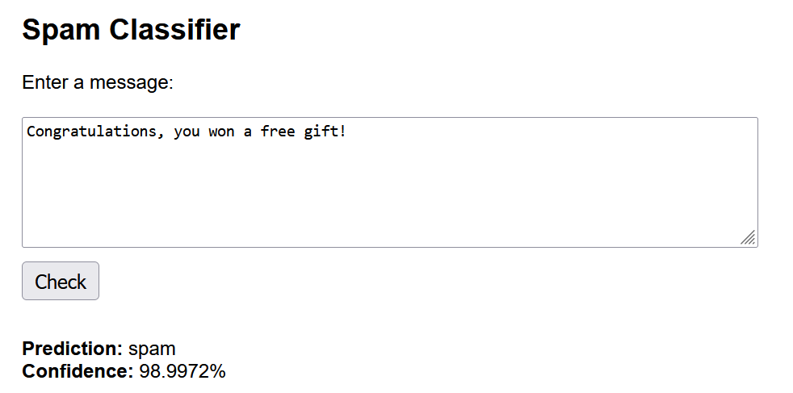

# Spam Detection Classifier with Python

A binary classification NLP project that trains a model to classify SMS messages as **spam** or **ham** (not spam).

This project includes:
- A **Jupyter Notebook**: `spam_classification.ipynb` for training and testing different combinations of classifiers and vectorizers available in the scikit-learn library.
- A **Flask web app**: `app.py` the final trained model which can be used via an API.

### Dataset used

https://www.kaggle.com/datasets/uciml/sms-spam-collection-dataset

### Details
- Applied multiple classifiers and vectorizers from Scikit-learn.
- Selected the best-performing combination based on classification accuracy.
- Created a simple flask app for using the model.

Selected the best performing classifier 'OneVsRest Classifier SVC' with the Tf-idf vectorizer acheiving ~ 99% accuracy.

Enter message to classify to get model prection with confidence score.

### Model Evaluation
- Divided dataset into 80/20 train/test split.
- Used Scikit-learn's standard interface:
  - `fit(X, y)`: train model
  - `predict(X)`: predict class label
  - `score(X, y)`: evaluate accuracy
  - `predict_proba(X)`: get confidence scores

more details are provided in the python notebook

### Requirements and running
 - Python 3.7+
 - pip install scikit-learn pandas flask

 - run app.py and open `http://127.0.0.1:5000` in your browser

### Example usage:

